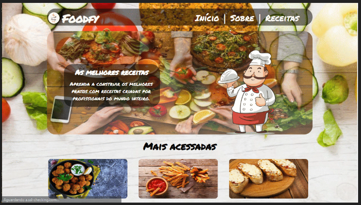

<h1 align="center"> Foodfy - Página de receitas <h1>

<h1>  <h1>


# Indice
- [Sobre](#-sobre)
- [Tópicos importantes](#-tópicos-importantes)
- [Tecnologias utilizadas](#-tecnologias-utilizadas)
- [Como baixar o projeto](#-como-baixar-o-projeto)

---

# 📋 Sobre
Projeto **Foodfy** é uma página de uma empresa ficticia de receitas, desenvolvida como sugestão de um dos desafios dentro do curso  **Bootcamp Launchbase** com o intuito de colocarmos em prática todo o conteúdo estudado. Principalmente a utilização de **Javaxcript** através de um **modal**

O projeto possui uma página **sobre** com informações sobre a empresa.

E a página receitas com todas as receitas do site disposta através do conceito de  **grids**


##  ❗ Tópicos Importantes
- [Modal](https://www.w3schools.com/howto/howto_css_modals.asp)
- [Grids](https://www.w3schools.com/css/css_grid.asp)

---

## 🚀 Tecnologias utilizadas 

O projeto foi desenvolvido utilizando as seguintes tecnologias:

- [HTML](https://www.w3schools.com/html/)
- [CSS](https://www.w3schools.com/css/default.asp)
- [Javascript](https://www.w3schools.com/js/default.asp)
- [Node.js](https://nodejs.org/en/)
- [Nunjucks](https://mozilla.github.io/nunjucks/)


---

## 📁 Como baixar o projeto
```bash

    #Clonar repositório
    $ git clone https://github.com/JayG32/foodfy

     #Entre na pasta do projeto
    cd foodfy

    #Instale as dependencias
    yarn install

    #Execute a aplicação
    yarn start

```

---
termos da licença MIT  |  Desenvolvido por 👩‍💻 Janiele Nogueira